<h1 align="center">🍎 Apple Health Ingester</h1>

<p align="center">
  <strong>Collect and visualize your Apple Health data in InfluxDB & Grafana</strong>
</p>

<p align="center">
  <a href="#features">Features</a> •
  <a href="#quick-start">Quick Start</a> •
  <a href="#configuration">Configuration</a> •
  <a href="#grafana-dashboard">Dashboard</a> •
  <a href="#api-reference">API</a>
</p>

<p align="center">
  
  
  
  
  
</p>

<br>

<p align="center">
  
</p>

---

## Overview

Apple Health Ingester receives health data from the [Health Auto Export](https://apps.apple.com/app/health-auto-export-json-csv/id1115567069) iOS app and stores it in InfluxDB for visualization with Grafana.

```mermaid
flowchart LR
    A["📱 iPhone/iPad<br>Apple Health"] --> B["📤 Health Auto<br>Export App"]
    B -->|JSON POST| C["⚙️ Apple Health<br>Ingester"]
    C -->|Write| D[("🗄️ InfluxDB")]
    D --> E["📊 Grafana<br>Dashboard"]
```



## Features

- **Automatic Import** — Receives data via REST API from Health Auto Export app
- **24+ Metrics** — Steps, heart rate, sleep, weight, workouts, and more
- **Sleep Analysis** — Deep, REM, core sleep phases with duration tracking
- **Workout Tracking** — Duration, distance, and energy for all workout types
- **Unit Conversion** — Automatic kcal→kJ, lb→kg conversion
- **Grafana Dashboard** — Pre-built dashboard with 16 panels included
- **Docker Ready** — Multi-stage build with health checks
- **Secure** — Optional API key authentication

## Quick Start

### Prerequisites

- [Health Auto Export](https://apps.apple.com/app/health-auto-export-json-csv/id1115567069) iOS app
- InfluxDB 2.x instance
- Docker (recommended) or Python 3.11+

### Installation

**Option 1: Docker (Recommended)**

```bash
# Clone the repository
git clone https://github.com/nichtlegacy/apple-health-ingester.git
cd apple-health-ingester

# Configure environment
cp .env.example .env
# Edit .env with your InfluxDB credentials

# Start the container
docker-compose up -d
```

**Option 2: Python**

```bash
# Clone and setup
git clone https://github.com/nichtlegacy/apple-health-ingester.git
cd apple-health-ingester

# Install dependencies
pip install -r requirements.txt

# Configure and run
cp .env.example .env
# Edit .env with your InfluxDB credentials
python -m src.main
```

### Configure Health Auto Export

1. Open **Health Auto Export** on your iPhone
2. Go to **Automations** → **Add Automation**
3. Configure:
   - **URL:** `http://your-server:8080/api/healthdata`
   - **Method:** POST
   - **Headers:** `Authorization: Bearer YOUR_API_KEY` (if configured)
4. Select metrics to export
5. Set automation interval (e.g., every 6 hours)

## Configuration

All settings are configured via environment variables:

| Variable | Required | Default | Description |
|----------|----------|---------|-------------|
| `INFLUXDB_URL` | Yes | - | InfluxDB server URL |
| `INFLUXDB_TOKEN` | Yes | - | InfluxDB API token |
| `INFLUXDB_ORG` | Yes | - | InfluxDB organization |
| `INFLUXDB_BUCKET` | No | `applehealth` | Target bucket name |
| `API_KEY` | No | - | API key for authentication |
| `LOG_LEVEL` | No | `INFO` | Logging level (DEBUG, INFO, WARNING, ERROR) |
| `PORT` | No | `8080` | Server port |

### Example `.env`

```bash
# InfluxDB Configuration (required)
INFLUXDB_URL=http://localhost:8086
INFLUXDB_TOKEN=your_token_here
INFLUXDB_ORG=your_org
INFLUXDB_BUCKET=applehealth

# Optional: API Key for authentication
API_KEY=your_secret_key

# Optional: Logging
LOG_LEVEL=INFO
```

## Grafana Dashboard

A pre-built dashboard is included at `grafana/dashboard.json`.

### Import Dashboard

1. Open Grafana → **Dashboards** → **Import**
2. Upload `grafana/dashboard.json`
3. Select your InfluxDB data source
4. Click **Import**

### Included Panels

| Panel | Description |
|-------|-------------|
| Total Steps | Sum of all steps in period |
| Avg Steps/Day | Daily average |
| Avg Heart Rate | Average heart rate |
| Avg Resting HR | Resting heart rate average |
| Avg Sleep/Night | Average sleep duration |
| Avg SpO2 | Blood oxygen average |
| Heart Rate | Time series chart |
| Resting Heart Rate | Time series chart |
| SpO2 | Blood oxygen over time |
| Sleep Analysis | Stacked bar chart (deep/core/REM/awake) |
| Steps per Day | Daily step count bars |
| Weight | Weight trend line |
| Walking/Running Distance | Daily distance |
| Active Energy | Daily energy burned |
| Headphone Audio | Audio exposure levels |
| Walking Metrics | Asymmetry & double support |

## API Reference

### Endpoints

| Method | Path | Description |
|--------|------|-------------|
| `GET` | `/` | Service info |
| `GET` | `/health` | Health check |
| `POST` | `/api/healthdata` | Ingest health data |
| `POST` | `/ingest` | Alias for healthdata |
| `POST` | `/` | Alias for healthdata |

### Health Data Request

```bash
curl -X POST http://localhost:8080/api/healthdata \
  -H "Content-Type: application/json" \
  -H "Authorization: Bearer YOUR_API_KEY" \
  -d '{
    "data": {
      "metrics": [...],
      "workouts": [...]
    }
  }'
```

### Response

```json
{
  "status": "success",
  "request_id": "a1b2c3d4",
  "metrics_imported": 150,
  "workouts_imported": 2,
  "points_written": 165
}
```

### Error Response

```json
{
  "status": "error",
  "error_code": "INFLUXDB_WRITE_ERROR",
  "message": "Failed to write data to InfluxDB",
  "details": "connection refused"
}
```

## Supported Metrics

<details>
<summary>Click to expand full list</summary>

**Activity**
- Step Count
- Flights Climbed
- Walking/Running Distance
- Cycling Distance
- Active Energy
- Basal Energy

**Heart**
- Heart Rate (min/avg/max)
- Resting Heart Rate
- Blood Oxygen Saturation

**Body**
- Weight
- Body Mass Index
- Body Fat Percentage
- Lean Body Mass

**Sleep**
- Total Sleep
- Deep Sleep
- REM Sleep
- Core Sleep
- Awake Time
- Time in Bed

**Other**
- Headphone Audio Exposure
- Walking Speed
- Walking Step Length
- Walking Asymmetry
- Walking Double Support

**Workouts**
- All workout types with duration, distance, and energy

</details>

## Project Structure

```
apple-health-ingester/
├── src/
│   ├── __init__.py       # Package initialization
│   ├── main.py           # FastAPI application
│   ├── config.py         # Environment configuration
│   ├── ingester.py       # Data processing logic
│   └── models.py         # Metric mappings
├── grafana/
│   └── dashboard.json    # Grafana dashboard
├── examples/
│   └── docker-compose.yml # Full stack example
├── .env.example          # Environment template
├── .gitignore
├── Dockerfile
├── docker-compose.yml
├── requirements.txt
└── README.md
```

## Troubleshooting

| Issue | Solution |
|-------|----------|
| `INFLUXDB_TOKEN not configured` | Set all required environment variables in `.env` |
| `Failed to connect to InfluxDB` | Check `INFLUXDB_URL` is reachable |
| `401 Unauthorized` | Verify `API_KEY` matches in app and server |
| No data in Grafana | Check bucket name matches; verify data source |
| Wrong units displayed | Data is stored in kJ (energy) and minutes (sleep) |

## Contributing

Contributions are welcome! Please feel free to submit a Pull Request.

1. Fork the repository
2. Create your feature branch (`git checkout -b feature/amazing-feature`)
3. Commit your changes (`git commit -m 'Add amazing feature'`)
4. Push to the branch (`git push origin feature/amazing-feature`)
5. Open a Pull Request

## License

Distributed under the MIT License. See `LICENSE` for more information.

## Acknowledgments

- [Health Auto Export](https://apps.apple.com/app/health-auto-export-json-csv/id1115567069) — iOS app for exporting health data
- [InfluxDB](https://www.influxdata.com/) — Time series database
- [Grafana](https://grafana.com/) — Visualization platform
- [FastAPI](https://fastapi.tiangolo.com/) — Modern Python web framework